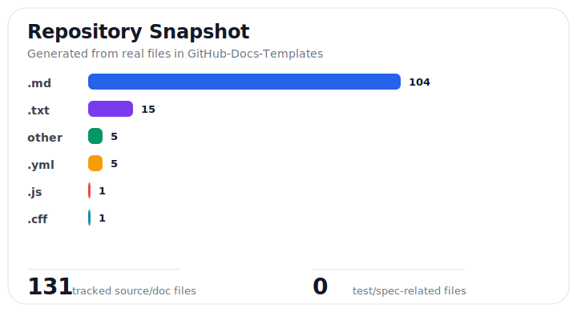
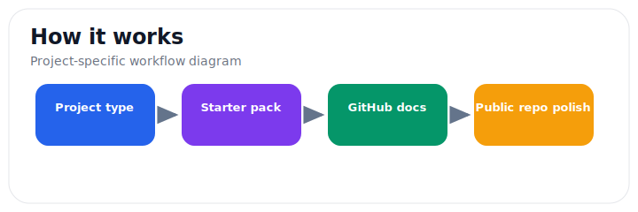

# GitHub Docs Templates

> Beginner-friendly templates for READMEs, contributing guides, issue/PR templates, security docs, changelogs, and starter packs.

 

**Documentation templates • open-source hygiene • starter packs**

## At a Glance

- Real project documentation now includes security guidance, contribution notes, issue/PR templates, and real visual snapshots.
- Maintenance snapshot: see [docs/project-snapshot.md](docs/project-snapshot.md) for a generated file-mix chart and repository checklist.
- Public repo: https://github.com/Evan1108-Coder/GitHub-Docs-Templates

---


## Real Visual Snapshot

These visuals are generated from the actual repository structure and project workflow, not placeholders.





> Status: stable template collection. These files are meant to be copied, edited, and simplified for each project.

This repo helps new project owners add the GitHub files people expect: README, license, contributing guide, security policy, issue templates, PR template, changelog, and starter docs.

## Which Template Should I Start With?

| Project type | Start here |
| --- | --- |
| Small personal repo | `starter-packs/personal-project/` |
| CLI tool | `starter-packs/cli-tool/` |
| Web app | `starter-packs/web-app/` |
| Docs site | `starter-packs/docs-site/` |
| Open-source library | `starter-packs/open-source-library/` |

## Current Limitations

- Templates still need project-specific editing before publishing.
- License choice is not legal advice. Pick the license that matches your intent.
- More examples are useful than more files; avoid adding documents your project will not maintain.


Beginner-friendly GitHub documentation templates, examples, and guides for new developers, open-source maintainers, students, and small teams.

This project helps you choose, copy, rename, and customize common GitHub files such as `README.md`, `LICENSE`, `CONTRIBUTING.md`, issue templates, pull request templates, security policies, support docs, changelogs, citation files, and more.

## Start Here

If you are new to GitHub docs, begin with [QUICKSTART.md](QUICKSTART.md).

You do not need every file in this repository. Most beginners only need:

1. `README.md`
2. `LICENSE`
3. `CONTRIBUTING.md`

The fastest path is to copy a folder from `starter-packs/`, then replace the placeholders.

## Quick Copy Paths

| If your project is a... | Start with this folder |
| --- | --- |
| Personal or school project | `starter-packs/personal-project/` |
| Open-source library | `starter-packs/open-source-library/` |
| Web app | `starter-packs/web-app/` |
| CLI tool | `starter-packs/cli-tool/` |
| Documentation site | `starter-packs/docs-site/` |

If you want to choose individual files instead, use `templates/`.

For a compact list of the most useful templates, see [TEMPLATE_INDEX.md](TEMPLATE_INDEX.md).

## Quality Checks

This repository includes a small validation script:

```bash
node scripts/validate.js
```

It checks relative links, starter packs, and template folder guides. See [QUALITY.md](QUALITY.md).

## Do I Need All Of This?

No. This repository includes many docs because different projects need different things.

| File | Beginner Need | What It Does |
| --- | --- | --- |
| `README.md` | Required | Explains the project. |
| `LICENSE` | Usually required for public repos | Explains how others may use the project. |
| `CONTRIBUTING.md` | Recommended | Explains how people can help. |
| `CODE_OF_CONDUCT.md` | Recommended for communities | Sets behavior expectations. |
| `SECURITY.md` | Recommended for public apps/packages | Explains how to report security problems. |
| Issue templates | Optional | Help people report bugs clearly. |
| Pull request template | Optional | Helps contributors explain changes. |
| `CHANGELOG.md` | Optional | Tracks changes between versions. |
| Everything else | Optional | Useful for larger or more organized projects. |

## Why The Template Files Have Long Names

Inside this project, template files use clear names so beginners can browse them easily:

- `README_minimal.md`
- `CONTRIBUTING_simple.md`
- `LICENSE_MIT.txt`
- `SECURITY_private_report.md`

When you use a template in your own repository, rename it to the standard GitHub filename:

- `README_minimal.md` becomes `README.md`
- `CONTRIBUTING_simple.md` becomes `CONTRIBUTING.md`
- `LICENSE_MIT.txt` becomes `LICENSE`
- `SECURITY_private_report.md` becomes `SECURITY.md`

## What Is Included

- `templates/README/` - README files for apps, libraries, CLIs, docs sites, personal projects, and open-source projects.
- `templates/LICENSE/` - many common license templates and a beginner guide to choosing one.
- `templates/CONTRIBUTING/` - contribution guides from simple to community-focused.
- `templates/ISSUE_TEMPLATE/` - bug, feature, question, documentation, and config templates.
- `templates/PULL_REQUEST_TEMPLATE/` - simple and detailed PR templates.
- `templates/CODE_OF_CONDUCT/` - community behavior templates.
- `templates/SECURITY/` - vulnerability reporting templates.
- `templates/SUPPORT/` - support and help templates.
- `templates/FUNDING/` - sponsorship setup templates.
- `templates/CHANGELOG/` - changelog formats.
- `templates/CITATION/` - citation metadata templates.
- `templates/GOVERNANCE/` - maintainer and decision-making docs.
- `templates/RELEASE/` - release notes and release checklist templates.
- `templates/DISCUSSIONS/` - GitHub Discussions category and welcome templates.
- `templates/ROADMAP/` - roadmap formats for future plans.
- `templates/AUTHORS/` - author and contributor lists.
- `templates/ACKNOWLEDGMENTS/` - credit and thanks pages.
- `templates/CODEOWNERS/` - GitHub code owner review templates.
- `templates/DEPENDABOT/` - dependency update configuration templates.
- `starter-packs/` - copy-ready sets for common project types.
- `examples/` - complete example documentation sets for common project types.
- `guides/` - beginner explanations, checklists, and glossary.
- `TEMPLATE_INDEX.md` - compact index of common copy paths.
- `QUALITY.md` - validation notes for maintaining the repository.

## Placeholder Style

Most templates use placeholders in square brackets:

```text
[PROJECT_NAME]
[PROJECT_DESCRIPTION]
[REPO_URL]
[CONTACT_EMAIL]
[MAINTAINER_NAME]
```

Replace every placeholder before publishing your documentation.

## License Notes

This repository is licensed under the MIT License.

The license templates in `templates/LICENSE/` are provided for convenience and learning. Choosing a license can affect how people can use your project. This project is not legal advice.